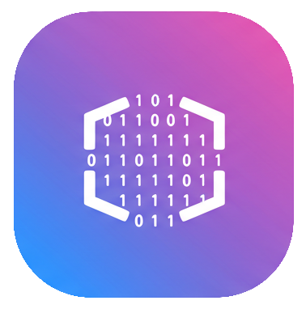

# Home

Welcome! This site showcases my **GitHub projects**, focused on learning and experimentation rather than polished apps or libraries. They’re a great starting point if you want to explore these concepts or build your own projects.

The blog also shares my **crackmes**, featuring **community solutions** that highlight different approaches and techniques for solving each challenge.

**My Profiles**

 [github.com/Fatmike-GH](https://github.com/Fatmike-GH)  

 [crackmes.one/Fatmike](https://crackmes.one/user/Fatmike)  

 [crackmy.app/Fatmike](https://crackmy.app/users/Fatmike)  

